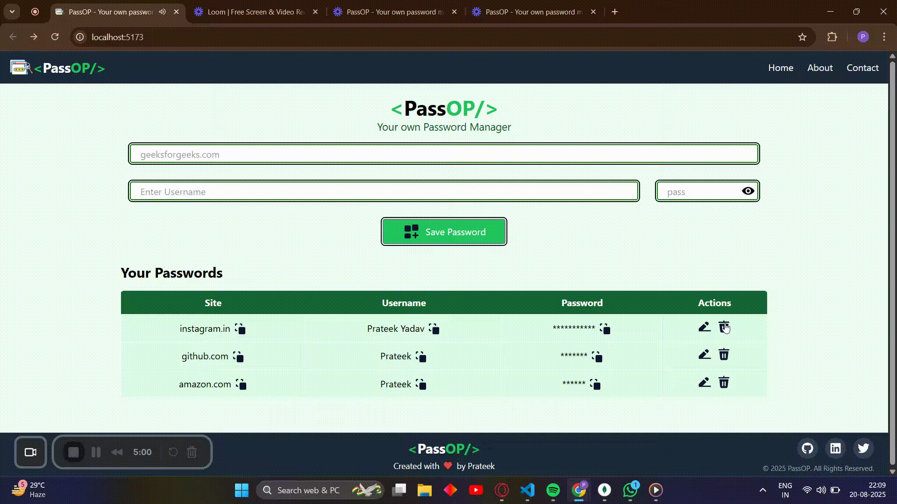
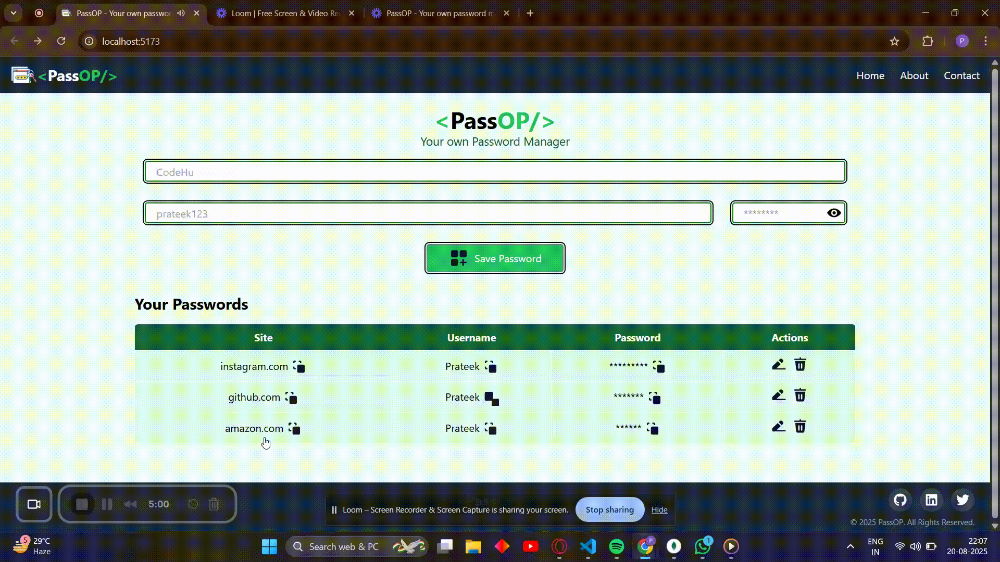
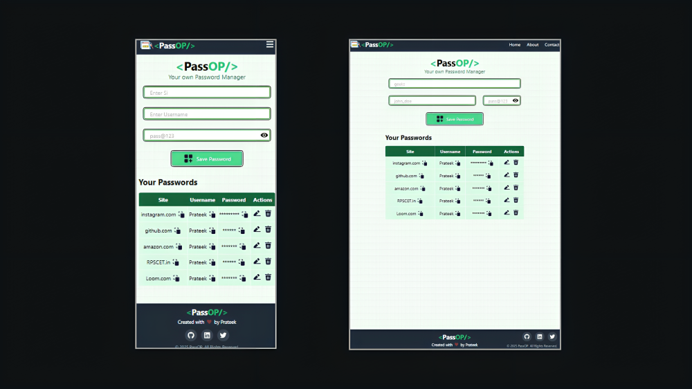

# 🔐 PassOp – Secure Password Manager  

PassOp is a modern and minimal **MERN-based Password Manager** where you can securely store, manage, and access your credentials at one place.  
Built with **React + Tailwind** on the frontend and **Node.js + Express + MongoDB** on the backend.

---

## 🚀 Features

✅ Add new credentials (website, username, password)  

📝 Edit saved entries  

❌ Delete credentials with confirmation prompt  

👀 Toggle visibility of saved passwords  

🔒 Encrypt sensitive data before storing in DB  

📱 Fully responsive design for all screen sizes  

---

## 🛠️ Tech Stack

- **Frontend:** React (Hooks & Functional Components), Tailwind CSS  
- **Backend:** Node.js, Express.js  
- **Database:** MongoDB (Mongoose ODM)  
- **Other:** UUID for IDs, bcrypt/crypto for security  

---

## 📸 Preview

### ➕ Adding Password

### ❌ Deleting Password

### ✏️ Editing Password

### 📱 Responsive Design

## 🔧 Future Improvements

- User authentication & JWT login system  
- Search & filter credentials  
- Dark mode toggle  
- Password generator tool  
- Export / Import credentials  

---

## 🤝 Contributing

Contributions are welcome!  
1. Fork the repo  
2. Create your feature branch (`git checkout -b feature/AmazingFeature`)  
3. Commit changes (`git commit -m 'Add some AmazingFeature'`)  
4. Push to branch (`git push origin feature/AmazingFeature`)  
5. Open a pull request  

---

⭐ If you like this project, don’t forget to **star the repo**!
